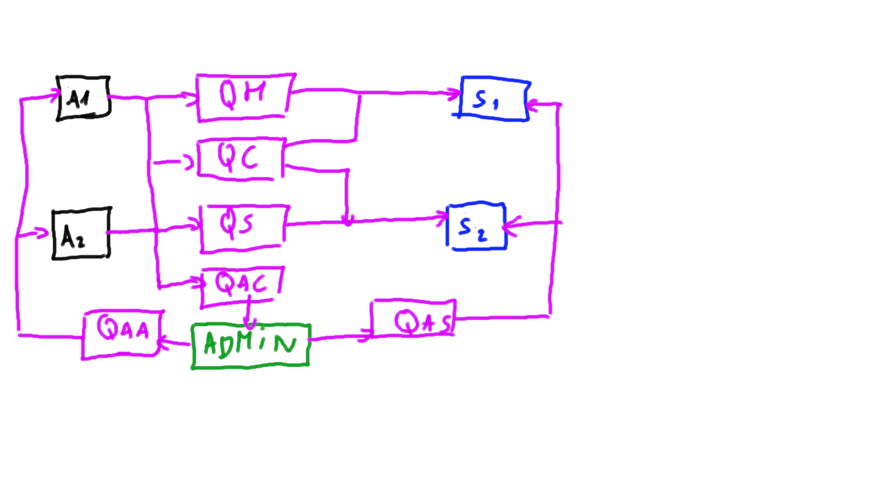

# Dokumentacja

## Użytkownicy

Aby ustawić użytkowników wraz z dostępami należy użyć polecenia:

```make
make prepare_users
```

### Admin

Administrator systemu - do niego spływają wszystkie kopie wiadomości oraz przesyła wiadomości do spedytorów i agencji \
**username**: admin \
**password**: admin \
**access**: vhost

### Agency

Agencja - wysyła do spedytorów zlecenia na transport gruzu, mięsa i złomu na orbitę \
**username**: agency \
**password**: agency \
**access**: vhost

### Speditor

Spedytor - odpowiada za transport gruzu i/lub mięsa i/lub złomu na orbitę \
**username**: speditor \
**password**: speditor \
**access**: vhost

## Kolejki

W systemie jest 6 kolejek
| Nazwa kolejki | Wysyłają | Odbierają |
|---|---|---|
| queue_human | Agency1, Agency2 | Speditor1, Speditor2 |
| queue_cargo | Agency1, Agency2 | Speditor1, Speditor2 |
| queue_satellite | Agency1, Agency2 | Speditor1, Speditor2 |
| queue_admin_copy | Agency1, Agency2 | Admin |
| queue_admin_spedit | Admin | Speditor1, Speditor2 |
| queue_admin_agency | Admin | Agency1, Agency2 |



## Klucze

Kluczami są po prostu nazwy kolejek tak aby nie wprowadzać zbędnego zamieszania. Poza tym najciemniej pod latarnią i nikt tych kluczy nie zgadnie.

## Mechanizmy

Został zastosowany mechanizm automatycznych potwierdeń podczas "konsumowania" wiadomości. \
Dedykotwna biblioteka do logowania 

## Uruchamianie systemu

1. Należy zainstalować Go 1.20 na własną rękę
2. `make prepare_system`
3. Odpalić wszystkie make po kolei
